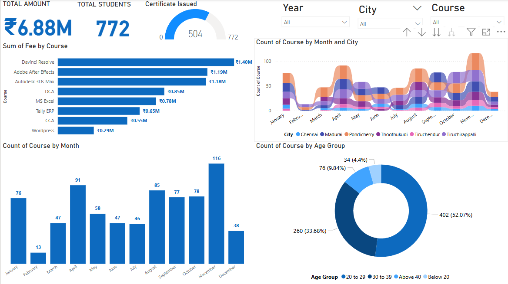

# 📊 APT Institute Power BI Dashboard

A dynamic and visually appealing Power BI dashboard designed for **APT Institute** to analyze and monitor student enrollment, course trends, revenue generation, and certificate issuance across different cities and age groups.

---

## 🚀 Project Overview

This Power BI project provides deep insights into:
- 💰 **Total Revenue** generated: ₹6.88M  
- 🎓 **Total Students Enrolled**: 772  
- 🏅 **Certificates Issued**: 504  
- 📆 Course trends by **month and city**  
- 🧑‍🎓 Enrollment breakdown by **age group**  
- 📚 Popular courses and revenue contribution  

---

## 📌 Key Features

- **Interactive Filters** by Year, City, and Course
- **City-Wise Monthly Trends** for course counts
- **Age Group Distribution** in a clean donut chart
- **Course-wise Revenue Analysis** with horizontal bars
- **Monthly Enrollment Comparison** via bar charts
- Real-time **Certificate Issuance Tracking**

---

## 🛠️ Tools Used

- [Microsoft Power BI](https://powerbi.microsoft.com/)
- DAX (Data Analysis Expressions)
- Data Cleaning and Modeling in Power BI

---

## 📁 Project Files

- `APT Inst.pbix` – Power BI project file
- `PBi.PNG` – Dashboard screenshot preview

---

## 📈 Insights Derived

- **Davinci Resolve**, **Adobe After Effects**, and **Autodesk 3Ds Max** were top revenue-generating courses.
- Highest enrollment was in **November (116)**.
- Majority of students were aged **20 to 29** (52.07%).
- Significant contributions came from cities like **Chennai**, **Madurai**, and **Pondicherry**.

---

## 📥 How to Use

1. Open `APT Inst.pbix` using Power BI Desktop.
2. Connect to your dataset (if needed).
3. Interact with filters for Year, City, and Course to explore insights.
4. Customize visuals as per your institutional or business goals.

---

## 📬 Contact

If you liked this project or want a custom dashboard:

📧 **Aswin Ash**  
🔗 [LinkedIn](https://www.linkedin.com/in/aswinash05/)  
💻 [GitHub](https://github.com/AswinAsh05)

---

⭐ _Star this repo to support and stay updated with more cool Power BI projects!_
